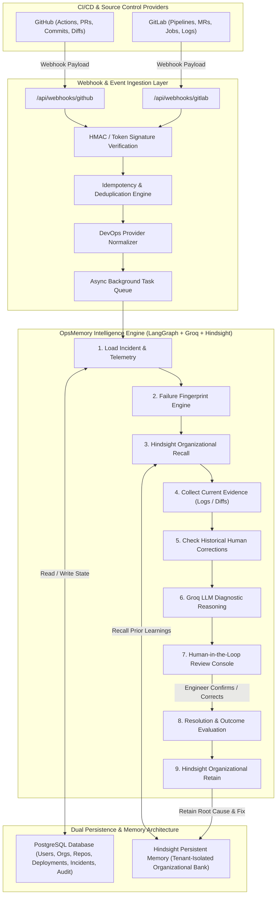

# OpsMemory Production Architecture & Design

> **"Your DevOps agent that remembers what your team learned."**

OpsMemory is a production-grade DevOps intelligence platform connecting to source control and CI/CD pipelines (GitHub & GitLab), observing deployments, investigating failures using current evidence and long-term organizational memory, and continuously learning from engineer corrections using Hindsight.

---

## 1. System Architecture Diagram



---

## 2. Architectural Separation of Concerns

1. **PostgreSQL Relational State**:
   - Stores deterministic relational entities: Multi-tenant Organizations, Users, Integrations, Repositories, Deployments, Incidents, Pipeline Runs, and Audit Logs.
   - Foreign keys, indexes, and strict timestamps ensure complete compliance and auditability.

2. **Hindsight Persistent Memory Layer**:
   - Maintains durable organizational intelligence across deployments and incidents.
   - Enforces multi-tenant namespace isolation (`bank_id = opsmemory-org-{org_id}`).
   - Stores engineer corrections, verified root causes, failure patterns, and remediation outcomes.

3. **DevOpsProvider Abstraction (`GitHubProvider` & `GitLabProvider`)**:
   - Converts proprietary GitHub and GitLab payloads into normalized internal models (`NormalizedRepository`, `NormalizedCommit`, `NormalizedPipelineRun`, `NormalizedWebhookPayload`).
   - Ensures the rest of OpsMemory has zero provider-specific coupling.

4. **LangGraph Investigation Workflow**:
   - Coordinates multi-stage incident investigations with conditional human-in-the-loop branching (`confirm`, `correct`, `reject`).

5. **Groq LLM Reasoning**:
   - Fast inference over current telemetry and Hindsight historical memories to formulate root-cause hypotheses and confidence-scored remediations.

---

## 3. The Core Learning Loop

```
CI/CD PIPELINE FAILURE (GitHub / GitLab)
             ↓
WEBHOOK INGESTION & HMAC SIGNATURE VERIFICATION
             ↓
FAILURE FINGERPRINT ENGINE (e.g. PAYMENT_API_DB_POOL_PRODUCTION)
             ↓
HINDSIGHT MEMORY RECALL (Historical Corrections & Resolution Effectiveness)
             ↓
LANGGRAPH INVESTIGATION (Current Diffs + Pod Logs + Groq Synthesis)
             ↓
AI DIAGNOSIS PRESENTED TO ENGINEER
             ↓
ENGINEER CORRECTION ("Redis was only a symptom; DB pool exhaustion was root cause")
             ↓
RESOLUTION OUTCOME RECORDED (Increase DB pool size - 100% success)
             ↓
HINDSIGHT RETAIN (Stored into tenant memory bank)
             ↓
FUTURE SIMILAR FAILURE → INSTANT RECALL & ACCURATE FIRST-TIME DIAGNOSIS!
```
